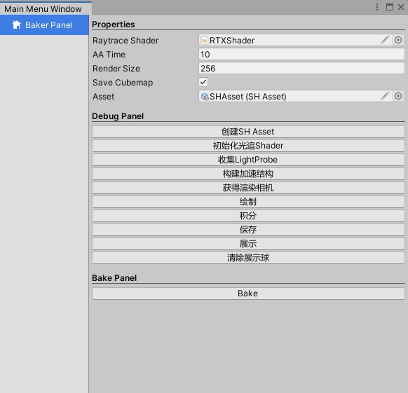

# RTXBaker

### 功能

### 运行环境

- Unity 2021.3.6f1c1
- DX12 RTX2070s [Unity raytrace 硬件要求](https://docs.unity3d.com/Packages/com.unity.render-pipelines.high-definition@13.1/manual/Ray-Tracing-Getting-Started.html#HardwareRequirements)
- Unity SRP

### 安装方法

### 参考

[RTIOW in Unity](https://github.com/zhing2006/GPU-Ray-Tracing-in-One-Weekend-by-Unity-2019.3#gpu-ray-tracing-in-one-weekend-by-unity-20193)

[RTIRL in Unity](https://github.com/zhing2006/GPU-Ray-Tracing-in-Rest-of-Your-Life-by-Unity-2019.3)

[UE4 IBL](https://cdn2-unrealengine-1251447533.file.myqcloud.com/Resources/files/2013SiggraphPresentationsNotes-26915738.pdf)

[3阶SH模拟Irradiance Map](https://zhuanlan.zhihu.com/p/476612991)

[CubeMap To SH](https://github.com/Crocs512/GAMES202-HW/blob/1b15139b633b39124670dd5cbe79ecb4124470c4/homework2/prt/src/prt.cpp)

[GAMES 202](https://games-cn.org/games202/)
