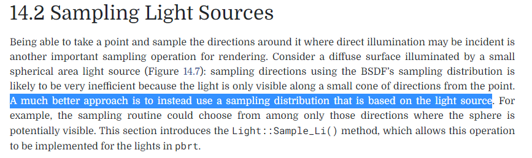
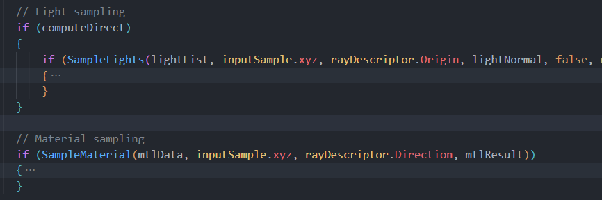

# 开发日志

## 我对光追的理解

### 前言

光追是一种全局光照算法（至少是我这个语境中光追是这样的）

### 光栅化

如何将3D场景渲染到2D屏幕中？老八股了，CPU做收集信息、剔除等操作，传参到GPU，GPU中进行着色计算，最后将信息转化到屏幕空间输出。

对某一个点（像素、片元）着色时，我们输入**该点信息**（FragInput）、**该点材质信息**（SurfaceData）、**该点入射辐照度**（Irradiance），最后得到一个出射辐射率，输出

为啥是得到一个出射辐射率呢？假设人眼是个点，你看某个点，能且仅能看到沿着两点连线方向传播的光，这个方向被称为出射方向，而描述出射光线颜色的方法，是出射辐射率（Radiance）

#### 灯光

对GPU来说，灯光是什么？灯光没有mesh，没有顶点，甚至不属于我们前面说的3D场景，如果没有辅助线，其实根本看不到，你在游戏场景“看到”一个光，其实是因为周围的明亮变化，让你感觉这里有一个光

游戏引擎（Unity）中灯光是一个抽象结构，我们在CPU中收集信息后，以数组的形式传到GPU中（比如以全局变量的形式），然后在着色的时候用这个数组来当参数

#### 入射辐照度

我们上面说游戏中的灯光是抽象的光，这些光有什么特点呢？抽象、离散、没有体积（其实Unity的面光很特殊，我们先*开除光籍*）

光沿直线传播，你可以发现，这些抽象的光发出的光线，最多只有一条能直接打到材质上某点，那么这些光为这个点带来的辐照度就是辐射率之和
$$
E_{直接}
=\int^{}_{\Omega } L \cos \theta  \mathrm{d} \omega 
=\sum^{n}_{i=1}L_{i}\cos \theta
$$

- 直接光入射辐照度可以直接通过遍历灯光得到

- 间接光带来入射辐照度可以通过IBL得到

### Path Trace

光追有很多种，离线逆向光追可以追很多次，直到超出光追次数或者打到光源，《RIOW》中就是这样做的，能看出，这个算法很直观，很暴力。

#### 灯光

写过的同学会发现，《RIOW》的灯光有两种：天空盒和面光源

实时渲染中很难处理的面光源，在光追中反而是最好实现的。。。

回到游戏引擎，引擎内提供的光源是抽象的光源，没有体积、面积（其实当你用Raytrace时，引擎可能会提供体积光和面光），对这些抽象的光做逆向光追是低效的

*就比如说点光，空间中的点，有体积吗？就算有，收敛速度够快吗？*

为了提高收敛速度，我们在对某一点raytrace时，有一半概率采样材质，另一半概率去**直接照明**

这意味着什么？从这一个角度去想，光追就不再是和光栅化平级的东西（指如何在屏幕上显示像素），而是一种**全局光照算法**了

求某点反射光，需要知道作用到该点的直接光和间接光，直接光通过遍历光源计算，间接光来自周围的反射光，于是形成了递归

而且从数值层面上，大部分的光都来自直接光或者由直接光转化而来，所以不需要追特别多次，就能得到比较好的效果

